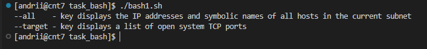
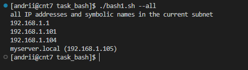
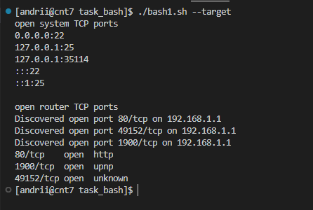
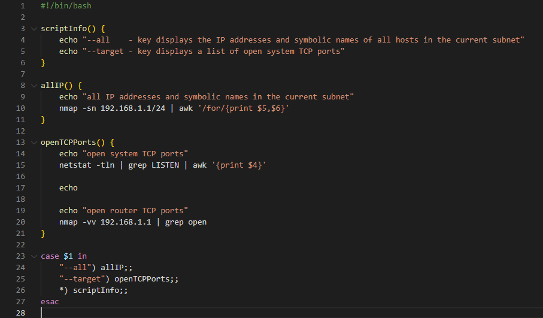

# 01-LinuxBashTask

## Task A

***
Create a script that uses the following keys:

1. When starting without parameters, it will display a list of possible keys and their description.
2. The --all key displays the IP addresses and symbolic names of all hosts in the current subnet
3. The --target key displays a list of open system TCP ports.
The code that performs the functionality of each of the subtasks must be placed in a separate function

***

## Answers

***

### 1. When starting without parameters, it will display a list of possible keys and their description

***

### 2. The --all key displays the IP addresses and symbolic names of all hosts in the current subnet

***

### 3. The --target key displays a list of open system TCP ports

***

## Code

