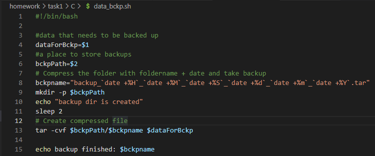

# 01-LinuxBashTask

## Task C

***
Create a data backup script that takes the following data as parameters:

1. Path to the syncing directory.
2. The path to the directory where the copies of the files will be stored.

In case of adding new or deleting old files, the script must add a corresponding entry to the log file indicating the time, type of operation and file name. [The command to run the script must be added to crontab with a run frequency of one minute]

***

## Answers

***

### Cron expressions with created archives

***

## Code

