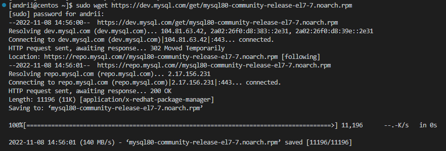
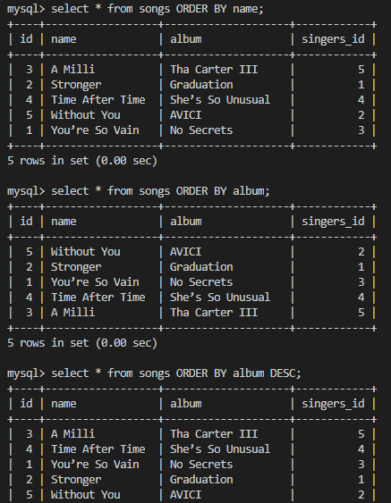

# 02-Database_Administration_Task

## Part1

***

1. Download MySQL server for your OS on VM.
2. Install MySQL server on VM.
3. Select a subject area and describe the database schema, (minimum 3 tables)
4. Create a database on the server through the console.
5. Fill in tables.
6. Construct and execute SELECT operator with WHERE, GROUP BY and ORDER BY.
7. Execute other different SQL queries DDL, DML, DCL.
8. Create a database of new users with different privileges. Connect to the database as a new user and verify that the privileges allow or deny certain actions.
9. Make a selection from the main table DB MySQL.

***

## Answers

***

### 1. Download MySQL server for your OS on VM

***

### 2. Install MySQL server on VM

***

### 3. Select a subject area and describe the database schema, (minimum 3 tables)

***

### 4. Create a database on the server through the console

&emsp; 4.1 Create and show database.

***

&emsp; 4.2 Use database, create and show tables singers.

***

&emsp; 4.3 Create and show tables songs.

***

### 5. Fill in tables

&emsp; 5.1 Fill in tables.

***

&emsp; 5.2 Select from songs.

***

### 6. Construct and execute SELECT operator with WHERE, GROUP BY and ORDER BY

&emsp; 6.1 Select from songs where singers and name.

***

&emsp; 6.2 Select count(id), name, surname.

***

&emsp; 6.3 Select from songs.

***

### 7. Execute other different SQL queries DDL, DML, DCL

&emsp; 7.1 Modify and describe songs.

***

&emsp; 7.2 Update singers.

***

&emsp; 7.3 Revoke delete.

***

### 8. Create a database of new users with different privileges. Connect to the database as a new user and verify that the privileges allow or deny certain actions

&emsp; 8.1 Create user "dev1".

***

&emsp; 8.2 Grant all privileges.

***

&emsp; 8.3 Connect to the database.

***

### 9. Make a selection from the main table DB MySQL

