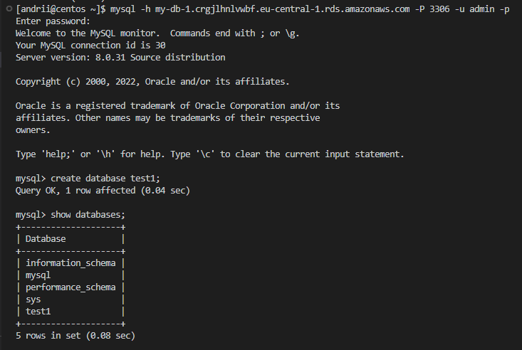

# 02-Database_Administration_Task

## Part2

***

10. Make backup of your database.
11. Delete the table and/or part of the data in the table.
12. Restore your database.
13. Transfer your local database to RDS AWS.
14. Connect to your database.
15. Execute SELECT operator similar step 6.
16. Create the dump of your database.

***

## Answers

***

### 10. Make backup of your database

***

### 11. Delete the table and/or part of the data in the table

***

### 12. Restore your database

&emsp; 12.1 Restore database.

***

&emsp; 12.2 Show tables and select from singers.

***

### 13. Transfer your local database to RDS AWS

&emsp; 13.1 Create database in AWS.

***

&emsp; 13.2 Connect to database in AWS RDS and show databases.

***

&emsp; 13.3 Transfer database to AWS RDS.

***

### 14. Connect to your database

***

### 15. Execute SELECT operator similar step 6

***

### 16. Create the dump of your database

