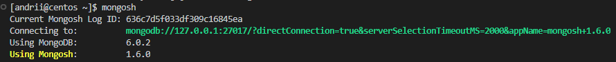
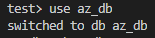
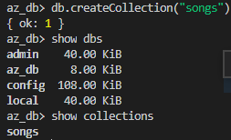
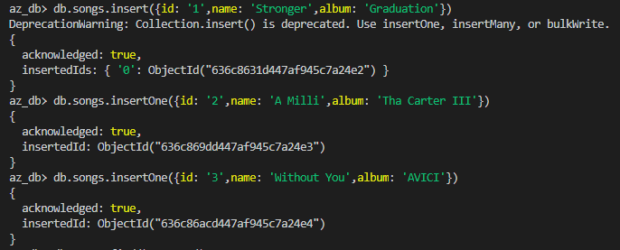
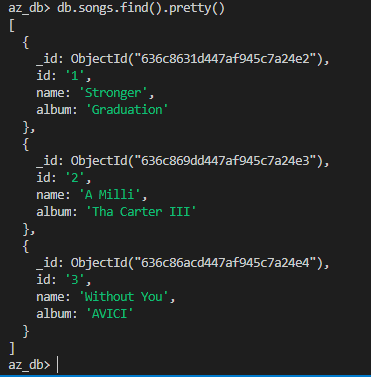

# 02-Database_Administration_Task

## Part3 – MongoDB

***

17. Create a database. Use the use command to connect to a new database (If it doesn't exist, Mongo will create it when you write to it).
18. Create a collection. Use db.createCollection to create a collection. I'll leave the subject up to you. Run show dbs and show collections to view your database and collections.
19. Create some documents. Insert a couple of documents into your collection. I'll leave the subject matter up to you, perhaps cars or hats.
20. Use find() to list documents out.

***

## Answers

***

### 17. Create a database. Use the use command to connect to a new database (If it doesn't exist, Mongo will create it when you write to it)

&emsp; 17.1 Install MongoDB and connect to it.

***

&emsp; 17.2 Use database in MongoDB.

***

### 18. Create a collection. Use db.createCollection to create a collection. I'll leave the subject up to you. Run show dbs and show collections to view your database and collections.

***

### 19. Create some documents. Insert a couple of documents into your collection. I'll leave the subject matter up to you, perhaps cars or hats

***

### 20. Use find() to list documents out

