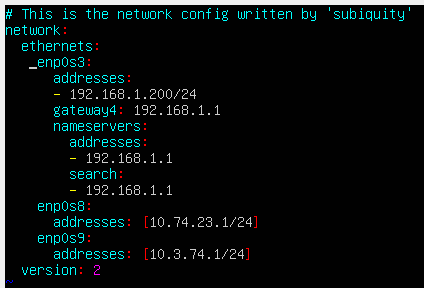
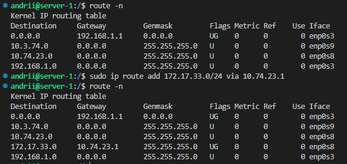
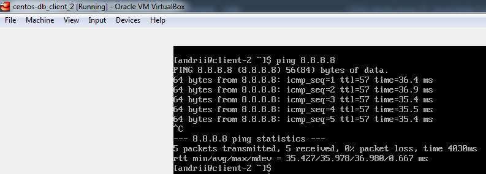

# 03-Linux-Networking-Task

## Linux Networking

***

1. На Server_1 налаштувати статичні адреси на всіх інтерфейсах.
2. На Server_1 налаштувати DHCP сервіс, який буде конфігурувати адреси Int1 Client_1 та Client_2
3. За допомогою команд ping та traceroute перевірити зв'язок між віртуальними машинами. Результат пояснити.
Увага! Для того, щоб з Client_1 та Client_2 проходили пакети в мережу Internet (точніше щоб повертались з Internet на Client_1 та Client_2) на Wi-Fi Router необхідно
налаштувати статичні маршрути для мереж Net2 та Net3. Якщо такої можливості немає інтерфейс Int1 на Server_1 перевести в режим NAT.
4. На віртуальному інтерфейсу lo Client_1 призначити дві ІР адреси за таким правилом: 172.17.D+10.1/24 та 172.17.D+20.1/24. Налаштувати маршрутизацію таким чином, щоб трафік з Client_2 до 172.17.D+10.1 проходив через Server_1, а до 172.17.D+20.1 через Net4. Для перевірки використати traceroute.
5. Розрахувати спільну адресу та маску (summarizing) адрес 172.17.D+10.1 та 172.17.D+20.1, при чому префікс має бути максимально можливим. Видалити маршрути, встановлені на попередньому кроці та замінити їх об’єднаним маршрутом, якій має проходити через Server_1.
6. Налаштувати SSH сервіс таким чином, щоб Client_1 та Client_2 могли підключатись до Server_1 та один до одного.
7. Налаштуйте на Server_1 firewall таким чином:

* Дозволено підключатись через SSH з Client_1 та заборонено з Client_2
* З Client_2 на 172.17.D+10.1 ping проходив, а на 172.17.D+20.1 не проходив.

8. Якщо в п.3 була налаштована маршрутизація для доступу Client_1 та Client_2 до мережі Інтернет – видалити відповідні записи. На Server_1 налаштувати NAT сервіс таким чином, щоб з Client_1 та Client_2 проходив ping в мережу Інтернет.

***

## Answers

***

### 1. На Server_1 налаштувати статичні адреси на всіх інтерфейсах

&emsp; 1.1 Configurations for task:

* Int1 IP address: 192.168.1.200/24;
* Net2 network address: 10.74.23.0/24;
* Net3 network address: 10.3.74.0/24;
* Net4 network address: 172.16.23.0/24.

***

&emsp; 1.2 Server_1 configuration:

* network configuration;

* IP address configuration in /etc/netplan/00-installer-config.yaml;

* system hostname configurations.

***

&emsp; 1.3 Client_1 configuration:

* network configuration;

* IP address configuration in /etc/netplan/00-installer-config.yaml;

* system hostname configurations.

***

&emsp; 1.4 Client_2 configuration:

* network configuration;

* IP address configuration;

* system hostname configurations.

***

&emsp; 1.5 A new configuration was accepted on the Server_1.

***

&emsp; 1.6 A new configuration was cheked on the Server_1.

***

### 2. На Server_1 налаштувати DHCP сервіс, який буде конфігурувати адреси Int1 Client_1 та Client_2

&emsp; 2.1 A DHCP server has been installed on Server_1.

***

&emsp; 2.2 Configuration of the dhcp.conf.

***

&emsp; 2.3 Settings have been changed for two interfaces.

***

&emsp; 2.4 DHCP server has been started.

***

&emsp; 2.5 Restart network manager on the Client_2. Make "ping" to Server_1.

***

&emsp; 2.6 Restart network manager on the Client_2. Make "ping" to Server_1.

***

&emsp; 2.7 Netplan apply on the Server_1. Make "ping" to Server_1.

***

&emsp; 2.8 Edit /etc/sysctl.conf file. Restart network manager on the Server_1.

***

### 3. За допомогою команд ping та traceroute перевірити зв'язок між віртуальними машинами. Результат пояснити

Увага! Для того, щоб з Client_1 та Client_2 проходили пакети в мережу Internet (точніше щоб повертались з Internet на Client_1 та Client_2) на Wi-Fi Router необхідно
налаштувати статичні маршрути для мереж Net2 та Net3. Якщо такої можливості немає інтерфейс Int1 на Server_1 перевести в режим NAT.

&emsp; 3. Check the connection from Server_1 to Client_1 and Client_2.

* Server_1 -> Client_1

* Client_1 -> Server_1

***

### 4. На віртуальному інтерфейсу lo Client_1 призначити дві ІР адреси за таким правилом: 172.17.D+10.1/24 та 172.17.D+20.1/24. Налаштувати маршрутизацію таким чином, щоб трафік з Client_2 до 172.17.D+10.1 проходив через Server_1, а до 172.17.D+20.1 через Net4. Для перевірки використати traceroute

&emsp; 4.1 lo configuration on the Client_1:

* the first IP address: 172.17.33.1/24;
* the second IP address: 172.17.43.1/24;

***

&emsp; 4.2 Edit /etc/netplan/00-installer-config.yaml on the Client_1 to add 2 IP addresses.

***

&emsp; 4.3 A new configuration was accepted on the Server_1.

***

&emsp; 4.4 A new configuration was cheked on the Server_1.

***

&emsp; 4.5 The route rule has been added.

***

&emsp; 4.6 The route rule has been checked by using "ping" and "traceroute".

***

&emsp; 4.7 The route rule has been added to the Server_1.

***

&emsp; 4.8 The route rule has been checked by using "ping" and "traceroute" from the Client_2.

***

### 5. Розрахувати спільну адресу та маску (summarizing) адрес 172.17.D+10.1 та 172.17.D+20.1, при чому префікс має бути максимально можливим. Видалити маршрути, встановлені на попередньому кроці та замінити їх об’єднаним маршрутом, якій має проходити через Server_1

&emsp; 5.1 The previous route rule has been deleted from the Server_1.

***

&emsp; 5.2 The previous route rule has been deleted from the Client_1.

***

&emsp; 5.3 Combined route calculation.

* 172.17.33.1 = 10101100.00010001.00100001 | 00000001
* 172.17.43.1 = 10101100.00010001.00101011 | 00000001
* Result: 172.17.32.0/20

***

&emsp; 5.4 The route rule has been added to the Server_1.

***

&emsp; 5.5 The route rule has been added to the Server_1.

***

&emsp; 5.6 The route rule has been checked by using "ping" and "traceroute" from the Client_2.

***

### 6. Налаштувати SSH сервіс таким чином, щоб Client_1 та Client_2 могли підключатись до Server_1 та один до одного

&emsp; 6.1 SSH connection has been checked from Client_1 to Server_1.

***

&emsp; 6.2 SSH connection has been checked from Client_2 to Server_1.

***

&emsp; 6.3 SSH connection has been checked from Client_1 to Client_2.

***

&emsp; 6.4 SSH connection has been checked from Client_2 to Client_1.

***

### 7. Налаштуйте на Server_1 firewall таким чином:

* ### Дозволено підключатись через SSH з Client_1 та заборонено з Client_2

* ### З Client_2 на 172.17.D+10.1 ping проходив, а на 172.17.D+20.1 не проходив

&emsp; 7.1 lo interfaces:

* 172.17.33.1
* 172.17.43.1

&emsp; 7.2 The route rules have been added to the Server_1 in the iptables.

***

&emsp; 7.3 SSH connection succeeded from Client_1 to Server_1.

***

&emsp; 7.4 SSH connection failed from Client_2 to Server_1.

***

&emsp; 7.5 The route rules have been added to the Server_1 to:

* accept ping from Client_2 to 172.17.33.1;
* drop ping from Client_2 to 172.17.43.1;

***

&emsp; 7.6 The accept and drop rules have been checked.

***

### 8. Якщо в п.3 була налаштована маршрутизація для доступу Client_1 та Client_2 до мережі Інтернет – видалити відповідні записи. На Server_1 налаштувати NAT сервіс таким чином, щоб з Client_1 та Client_2 проходив ping в мережу Інтернет

&emsp; 8.1 The NAT service was configured in the way that ping from Client_1 and Client_2 to the Internet could be performed.

***

&emsp; 8.2 "ping" passes from Client_1 to the Internet.

***

&emsp; 8.3 "ping" passes from Client_2 to the Internet.

