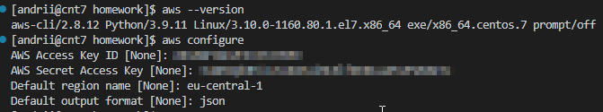
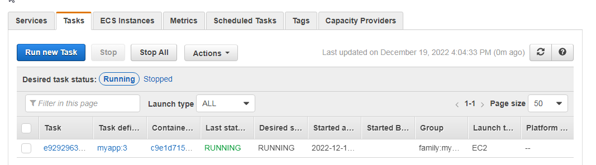

# 04-AWS Cloud Basic

1. Read the terms of Using the AWS Free Tier and the ability to control their own costs.
2. Register with AWS (first priority) or alternatively, you can request access to courses in AWS Academy if you are currently a student of certain University.
3. Find the hands-on tutorials and AWS Well-Architected Labs for your AWS needs. Explore list of step-by-step tutorials for deferent category. Use, repeat as many as you can and have fun))
4. Register and pass courses on AWS Educate. Filter by checking Topic Cloud Computing and Foundational Level. Feel free to pass more.
5. Register and pass free courses on AWS Skillbuilder. AWS Cloud Practitioner Essentials: Core Services, AWS Cloud Practitioner Essentials: Cloud Concepts. Try AWS Cloud Quest: Cloud Practitioner.
6. Pass free courses on Amazon qwiklabs
7. Review Getting Started with Amazon EC2. Log Into Your AWS Account, Launch, Configure, Connect and Terminate Your Instance. Do not use Amazon Lightsail. It is recommended to use the t2 or t3.micro instance and the CentOS operating system.
8. Create a snapshot of your instance to keep as a backup.
9. Create and attach a Disk_D (EBS) to your instance to add more storage space. Create and save some file on Disk_D.
10. Launch the second instance from backup.
11. Detach Disk_D from the 1st instance and attach disk_D to the new instance.
12. Review the 10-minute example. Explore the possibilities of creating your own domain and domain name for your site. Note, that Route 53 not free service. Alternatively you can free register the domain name *.PP.UA and use it.
13. Launch and configure a WordPress instance with Amazon Lightsail link
14. Review the 10-minute Store and Retrieve a File. Repeat, creating your own repository.
15. Review the 10-minute example Batch upload files to the cloud to Amazon S3 using the AWS CLI. Create a user AWS IAM, configure CLI AWS and upload any files to S3.
16. Review the 10-minute example Deploy Docker Containers on Amazon Elastic Container Service (Amazon ECS). Repeat, create a cluster, and run the online demo application or better other application with custom settings.
17. Run a Serverless "Hello, World!" with AWS Lambda.
18. Create a static website on Amazon S3, publicly available (link1 or link2 - using a custom domain registered with Route 53). Post on the page your own photo, the name of the educational program (EPAM Cloud&DevOps Fundamentals Autumn 2022), the list of AWS services with which the student worked within the educational program or earlier and the full list with links of completed labs (based on tutorials or qwiklabs). Provide the link to the website in your report and СV.

***

## Answers

***

### 1. Read the terms of Using the AWS Free Tier and the ability to control their own costs

DONE

### 2. Register with AWS (first priority) or alternatively, you can request access to courses in AWS Academy if you are currently a student of certain University

DONE

### 3. Find the hands-on tutorials and AWS Well-Architected Labs for your AWS needs. Explore list of step-by-step tutorials for deferent category. Use, repeat as many as you can and have fun))

DONE

### 4. Register and pass courses on AWS Educate. Filter by checking Topic Cloud Computing and Foundational Level. Feel free to pass more

DONE

### 5. Register and pass free courses on AWS Skillbuilder. AWS Cloud Practitioner Essentials: Core Services, AWS Cloud Practitioner Essentials: Cloud Concepts. Try AWS Cloud Quest: Cloud Practitioner

DONE

### 6. Pass free courses on Amazon qwiklabs

DONE

### 7. Review Getting Started with Amazon EC2. Log Into Your AWS Account, Launch, Configure, Connect and Terminate Your Instance. Do not use Amazon Lightsail. It is recommended to use the t2 or t3.micro instance and the CentOS operating system

&emsp; 7.1 Log Into my AWS Account.

***

&emsp; 7.2 Launch and configure my Instance.

***

***

&emsp; 7.3 Connect to the Instance.

***

### 8. Create a snapshot of the instance to keep as a backup

***

### 9. Create and attach a Disk_D (EBS) to your instance to add more storage space. Create and save some file on Disk_D

&emsp; 9.1 Create a volume.

***

&emsp; 9.2 Attach a volume to my instance.

***

***

&emsp; 9.4 Create and save some file on Disk.

***

### 10. Launch the second instance from backup

***

***

### 11. Detach Disk_D from the 1st instance and attach disk_D to the new instance

&emsp; 11.1 Detach the Disk from the 1st instance.

***

&emsp; 11.2 Attach the Disk to the new instance.

***

***

### 12. Review the 10-minute example. Explore the possibilities of creating your own domain and domain name for your site. Note, that Route 53 not free service. Alternatively you can free register the domain name *.PP.UA and use it

DONE

### 13. Launch and configure a WordPress instance with Amazon Lightsail link

&emsp; 13.1 Create a WordPress instance in Lightsail.

***

&emsp; 13.2 Connect to your instance via SSH and get the password for your WordPress website.

***

&emsp; 13.3 Create a Lightsail static IP address and attach it to your WordPress instance.

***

### 14. Review the 10-minute Store and Retrieve a File. Repeat, creating your own repository

&emsp; 14.1 Create an S3 Bucket.

***

&emsp; 14.2 Upload a file to my new Amazon S3 bucket.

***

### 15. Review the 10-minute example Batch upload files to the cloud to Amazon S3 using the AWS CLI. Create a user AWS IAM, configure CLI AWS and upload any files to S3

&emsp; 15.1 Create an AWS IAM user.

***

&emsp; 15.2 Configure access keys for this IAM user.

***

&emsp; 15.3 Install and configure AWS CLI.

***

&emsp; 15.4 Upload some files to S3.

### 16. Review the 10-minute example Deploy Docker Containers on Amazon Elastic Container Service (Amazon ECS). Repeat, create a cluster, and run the online demo application or better other application with custom settings

&emsp; 16.1 Create the Dockerfile with Apache web server.

***

&emsp; 16.2 Run the web server locally, using the Dockerfile from previous step.

***

&emsp; 16.3 Create ECR repository.

***

&emsp; 16.4 Tag the docker image and login to the ECR repository.

***

&emsp; 16.5 Push the docker image to the ECR repository.

***

&emsp; 16.6 A docker image is in an ECR repository.

***

&emsp; 16.7 Create the ECS cluster.

***

&emsp; 16.8 Create the Task Definition.

***

&emsp; 16.9 Configure the Container Definition.

***

&emsp; 16.10 Run the new task.

***

&emsp; 16.11 Run the online demo application with custom settings.

***

### 17. Run a Serverless "Hello, World!" with AWS Lambda

&emsp; 17.1 Select a Lambda blueprint.

***

&emsp; 17.2 Configure and create the Lambda function.

***

&emsp; 17.3 Configure Test Event.

***

&emsp; 17.4 Invoke Lambda function and verify results.

***

&emsp; 17.5 Monitor your metrics.

***

### 18. Create a static website on Amazon S3, publicly available (link1 or link2 - using a custom domain registered with Route 53). Post on the page your own photo, the name of the educational program (EPAM Cloud&DevOps Fundamentals Autumn 2022), the list of AWS services with which the student worked within the educational program or earlier and the full list with links of completed labs (based on tutorials or qwiklabs). Provide the link to the website in your report and СV

&emsp; 18.1 Create hosted zone.

***

&emsp; 18.2 Create domain on the nic.ua.

***

&emsp; 18.3 Input correct AWS NS for this domain.

***

&emsp; 18.4 Create two S3 buckets.

***

&emsp; 18.5 Upload website page with CV to the S3 bucket.

***

&emsp; 18.6 Configure the static website hosting option for the public bucket.

***

&emsp; 18.7 Add bucket policy.

***

&emsp; 18.8 Configure redirect requests from a private bucket to a public bucket.

***

&emsp; 18.9 Create A records for buckets in the hosted zone.

***

&emsp; 18.10 Create a static website on Amazon S3. It is available at [this link](http://zbr-it.pp.ua/).

***
